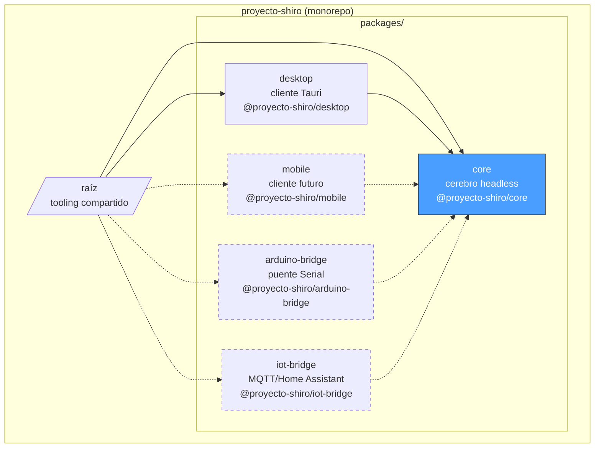
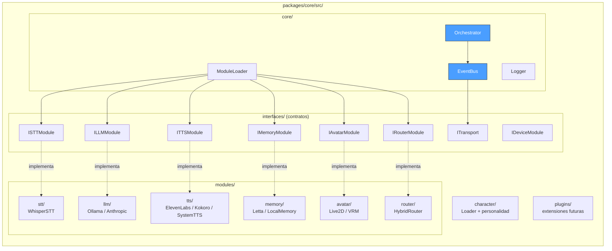
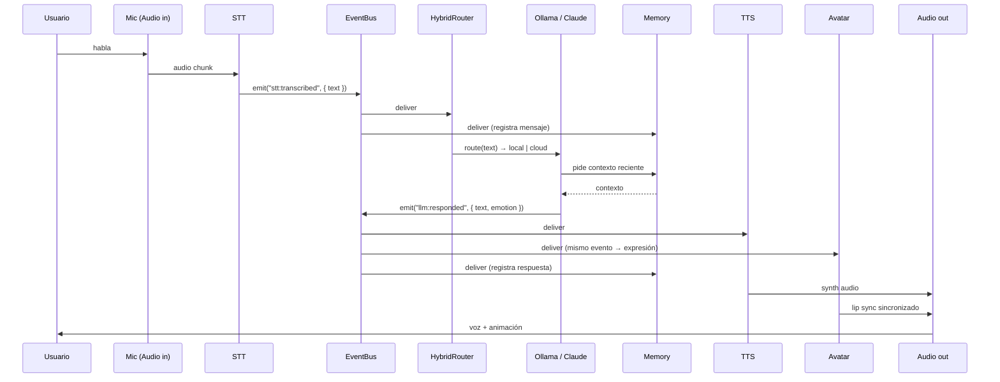
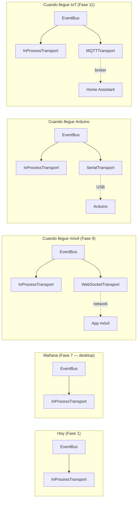

# Arquitectura de Proyecto Shiro

Documento vivo. Se actualiza cuando cambia algo estructural. Para el
detalle de **por qué** se decidió algo, ver [`adr/`](adr/).

> **Última actualización**: 2026-05-25 (post Fase 0).

## Visión a vista de pájaro

Proyecto Shiro es un AI companion modular que se puede ejecutar como:

- **App desktop autocontenida** (Tauri) — uso típico hoy.
- **Servicio headless** con clientes remotos (móvil, Arduino, IoT) — meta a medio plazo.

Esta dualidad determina la arquitectura: un **cerebro (core)
independiente** y **clientes ligeros** que se conectan.

## Estructura del monorepo

Las líneas punteadas son paquetes futuros. Los flujos van **del cliente
al core** (los clientes consumen el cerebro vía interfaces y eventos).

## Composición del core

**Claves de lectura:**

- Las **interfaces** son contratos. Los módulos los implementan; el
  orchestrator y el resto solo conocen los contratos.
- El **EventBus** no llama directamente a los módulos: emite eventos
  y los receptores se suscriben. Esto rompe el acoplamiento.
- El **ModuleLoader** lee `config/modules.config.yaml`, instancia la
  clase indicada para cada slot y la registra.

## Flujo de una conversación típica

**Notas del flujo:**

- Un mismo evento (`llm:responded`) tiene **varios suscriptores**: el TTS
  lo convierte en audio, el Avatar lo usa para expresión emocional, la
  Memoria lo persiste. Ninguno sabe de los otros — solo ven el bus.
- El `HybridRouter` decide si responde el LLM local (rápido, gratis) o
  el cloud (mejor calidad) según la complejidad estimada del mensaje.
- La memoria se inserta en dos puntos: lee contexto para el LLM, escribe
  cada turno de la conversación.

## Evolución de transportes

Hoy todo corre **in-process** (un solo `node`). Esa es la implementación
trivial del bus.

**Importante:** los módulos existentes (LLM, TTS, etc.) **no cambian**
cuando se añade un transporte nuevo. Solo se inyecta el transport
adicional al EventBus en el arranque. Ver
[ADR 0003](adr/0003-transport-abstraction-device-registry.md).

## Configuración

Dos archivos YAML en `config/`:

- **`modules.config.yaml`**: qué implementación se usa en cada slot
  (LLM, TTS, STT, Memory, Avatar, Router). Cadenas de fallback.
- **`devices.config.yaml`**: catálogo de dispositivos IoT/Arduino
  controlables (placeholder hoy, se llenará en Fase 11 o antes).

El `ModuleLoader` lee el primero al arrancar. El `DeviceRegistry`
leerá el segundo.

Validación de la forma de los YAML con **zod** (Fase 1).

## Personalidad y personaje

El "carácter" del companion (Shiro) vive en
`packages/core/src/character/characters/default.yaml`. Contiene:

- Identidad (nombre, pronombres, backstory).
- Rasgos de personalidad y estilo de habla.
- Mapeo de **emociones → parámetros TTS y expresiones del avatar**.

El `CharacterLoader` (Fase 2) inyecta esta info como system prompt en
cada conversación con el LLM y propaga los parámetros emocionales al
TTS y al Avatar cuando llega una respuesta.

## Cómo añadir un módulo nuevo (en 5 pasos)

1. Decide qué interfaz implementa (`ILLMModule`, `ITTSModule`, etc.).
   Si no encaja, considera si necesitas una nueva interfaz (escribe un ADR).
2. Crea la clase en `packages/core/src/modules/<categoría>/MiModulo.ts`.
3. Implementa los métodos de la interfaz. Comunica via EventBus.
4. Registra el módulo en `config/modules.config.yaml` (campo `active`
   del slot correspondiente).
5. Añade tests en `packages/core/tests/unit/` y opcionalmente integración.

Tiempo objetivo: menos de 2 horas para un módulo simple.

## Referencias internas

- [`adr/`](adr/) — historial de decisiones arquitectónicas.
- [`plan-modular-ai-companion.md`](../plan-modular-ai-companion.md) —
  visión y plan original.
