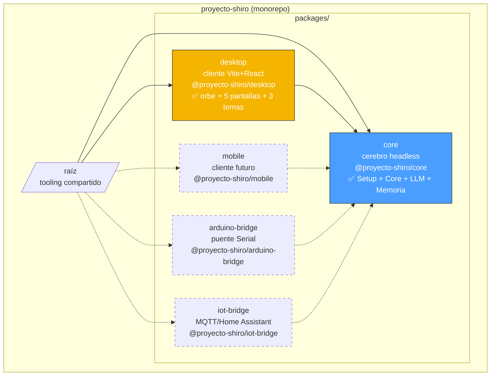
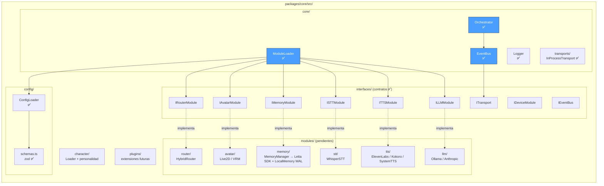
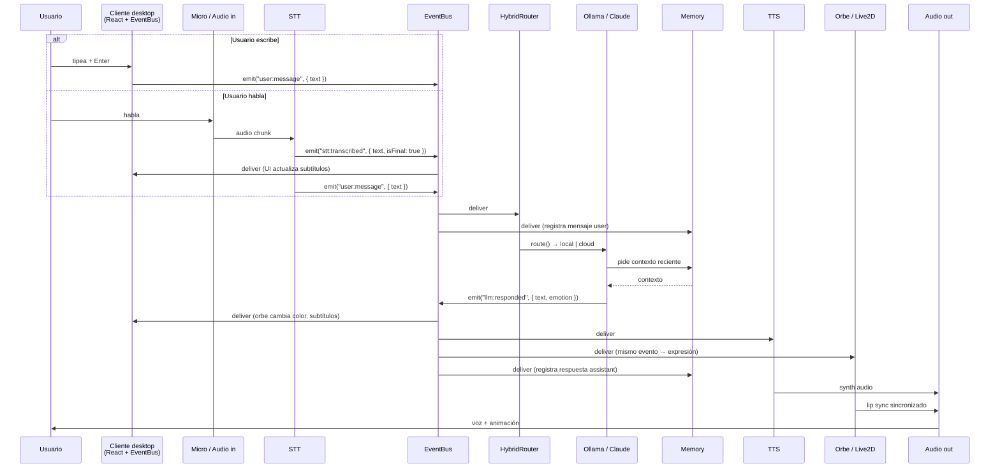
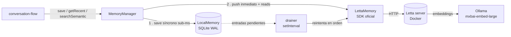
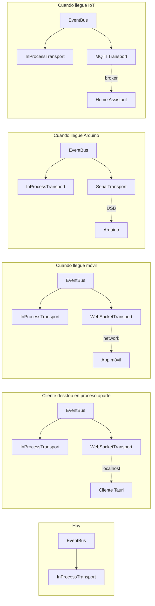

# Arquitectura de Proyecto Shiro

Documento vivo. Se actualiza cuando cambia algo estructural. Para el
detalle de **por qué** se decidió algo, ver [`adr/`](adr/).

> **Última actualización**: 2026-05-31 — tras mergear los hitos **Setup**,
> **Core**, **Cliente desktop** y **LLM**, y completar la mayor parte del
> hito **Memoria** (Letta vía SDK oficial + WAL local con drainer, ADRs
> 0017 y 0018; falta la hidratación del cliente al reconectar).

## Visión a vista de pájaro

Proyecto Shiro es un AI companion modular que se ejecuta como:

- **App desktop** — uso típico hoy. Cliente Vite+React empaquetado con
  Tauri en el hito Packaging.
- **Servicio headless** con clientes remotos (móvil, Arduino, IoT) — meta
  a medio plazo. El cerebro (core) corre como proceso/servicio
  independiente; cualquier cliente se conecta vía Transport.

Esta dualidad determina la arquitectura: un **cerebro (core)
independiente** y **clientes ligeros** que se conectan.

## Estructura del monorepo



Las líneas punteadas son paquetes futuros. Los flujos van **del cliente
al core** (los clientes consumen el cerebro vía interfaces y eventos).

## Composición del core



**Claves de lectura:**

- Las **interfaces** son contratos. Los módulos los implementan; el
  orchestrator y el resto solo conocen los contratos.
- El **EventBus** no llama directamente a los módulos: emite eventos
  y los receptores se suscriben. Esto rompe el acoplamiento. Ver
  [ADR 0001](adr/0001-arquitectura-modular-event-driven.md).
- El **ModuleLoader** lee `config/modules.config.yaml`, valida con zod,
  instancia la clase indicada para cada slot y la registra. Ver
  [ADR 0006](adr/0006-config-validation-zod.md) y
  [ADR 0007](adr/0007-module-loader-registry.md).
- El **Orchestrator** ata todo en el arranque, emite `bus:ready` y
  ofrece un punto de entrada limpio para los clientes.

## Composición del cliente desktop

`@proyecto-shiro/desktop` (Vite + React 18 + TS strict) consume el core
como dependencia local del workspace. Estructura prevista (ADRs 0008,
0009, 0010):

```
packages/desktop/src/
├── main.tsx                     ← Entry: instancia Logger, EventBus, Orchestrator
├── bus-context.tsx              ← BusProvider + useBus() + useBusEvent()
├── state/
│   └── companion-reducer.ts     ← Reducer alimentado por eventos del bus
├── components/
│   ├── Orb/                     ← Placeholder visual del avatar
│   │   ├── Orb.tsx
│   │   ├── Orb.module.css
│   │   └── useOrbAmplitude.ts
│   ├── Avatar/                  ← Decide Orb vs Live2D (cuando llegue)
│   ├── Sidebar/
│   ├── Header/
│   └── ChatPanel/
├── screens/
│   ├── ConversationScreen.tsx
│   ├── ModulesScreen.tsx        ← UI sobre modules.config.yaml
│   ├── CharacterScreen.tsx
│   ├── AvatarScreen.tsx
│   ├── SetupScreen.tsx
│   └── OnboardingScreen.tsx
├── themes/
│   ├── kawaii.css
│   ├── cyber.css
│   └── editorial.css
└── tweaks/                      ← Panel de configuración runtime
```

**Tres temas swap-eables** (kawaii pastel / cyberpunk / editorial)
definidos por CSS vars; el usuario los cambia desde settings sin
recompilar. Ver el bundle de diseño en
[`docs/design-mockup/`](design-mockup/).

### Mapeo state ↔ EventBus

El reducer del cliente se alimenta de eventos del core, y dispara
acciones cuando el usuario actúa:

| Acción del reducer | Origen                               | Evento del EventBus    |
| ------------------ | ------------------------------------ | ---------------------- |
| `LISTEN_START`     | `bus.on('stt:listening')` (futuro)   | `stt:listening`        |
| `STT_PARTIAL`      | `bus.on('stt:partial')`              | `stt:partial`          |
| `STT_FINAL`        | `bus.on('stt:transcribed')`          | `stt:transcribed`      |
| `THINK_START`      | `bus.on('router:routed')`            | `router:routed`        |
| `SHIRO_REPLY`      | `bus.on('llm:responded')`            | `llm:responded`        |
| `SPEAK_END`        | `bus.on('tts:audio-ended')`          | `tts:audio-ended`      |
| (usuario escribe)  | `bus.emit('user:message', { text })` | `user:message` (nuevo) |

Convenios documentados en
[ADR 0010](adr/0010-wiring-cliente-core-eventbus.md).

## Flujo de una conversación típica



**Notas del flujo:**

- El **cliente es el origen** del evento `user:message` (tanto si el
  input es texto como si es voz transcrita).
- Un mismo evento (`llm:responded`) tiene **varios suscriptores**: el
  cliente actualiza UI, el TTS lo convierte en audio, el Avatar/Orbe
  lo usa para expresión emocional, la Memoria lo persiste. Ninguno
  sabe de los otros — solo ven el bus.
- El `HybridRouter` decide si responde el LLM local (rápido, gratis) o
  el cloud (mejor calidad) según la complejidad estimada del mensaje.
- La memoria se inserta en dos puntos: lee contexto para el LLM, escribe
  cada turno de la conversación.

## Memoria: Letta canónico + WAL local

La memoria (ver [ADR 0017](adr/0017-memoria-persistente-local-y-letta.md) y
[ADR 0018](adr/0018-letta-sdk-oficial-embeddings-ollama.md)) la implementa el
`MemoryManager`, que cumple `IMemoryModule` y orquesta dos backends:



- **Escritura**: cada turno se persiste **primero** en el WAL local (SQLite,
  síncrono) y **luego** se empuja a Letta. Si Letta está caído, la entrada
  queda pendiente y el **drainer** la reenvía cuando vuelve. Cero turnos
  perdidos aunque Letta tartamudee.
- **Lectura** (`getRecent` cronológico + `searchSemantic` semántico): van a
  Letta, que es la verdad. Si Letta no está usable, devuelven `[]` rápido y
  el turno procede sin contexto (Shiro responde "ciego" ese turno).
- **Letta** se usa como _archival store_ semántico (no invocamos su flujo de
  agente; el LLM es nuestro). Los embeddings son **locales vía Ollama**.
- **Auto-provisión**: si no hay `agent_id` configurado, el manager crea el
  agente Letta al arrancar (con los handles de Ollama) y persiste su id en el
  WAL local para sobrevivir reinicios.

## Evolución de transportes

Hoy el cliente desktop comparte el mismo proceso Node del core, así
que un único `InProcessTransport` cubre el caso. Conforme lleguen
clientes en otros procesos/dispositivos, se añaden transports nuevos
**sin tocar los módulos existentes**.



**Importante:** los módulos existentes (LLM, TTS, etc.) **no cambian**
cuando se añade un transporte nuevo. Solo se inyecta el transport
adicional al EventBus en el arranque. Ver
[ADR 0003](adr/0003-transport-abstraction-device-registry.md).

## Configuración

Dos archivos YAML en `config/`:

- **`modules.config.yaml`**: qué implementación se usa en cada slot
  (LLM, TTS, STT, Memory, Avatar, Router). Cadenas de fallback.
- **`devices.config.yaml`**: catálogo de dispositivos IoT/Arduino
  controlables (placeholder hoy, se llenará junto con los bridges).

El `ModuleLoader` (ya implementado) lee el primero al arrancar y
valida con **zod**. El `DeviceRegistry` (interfaz definida, sin impl
todavía) leerá el segundo.

Ver [ADR 0006](adr/0006-config-validation-zod.md).

## Personalidad y personaje

El "carácter" del companion (Shiro) vive en
`packages/core/src/character/characters/default.yaml`. Contiene:

- Identidad (nombre, pronombres, backstory).
- Rasgos de personalidad y estilo de habla.
- Mapeo de **emociones → parámetros TTS y expresiones del avatar**.

El `CharacterLoader` (que se implementará junto al primer LLM real)
inyectará esta info como system prompt en cada conversación y
propagará los parámetros emocionales al TTS y al Orbe/Avatar cuando
llegue una respuesta.

El **orbe placeholder** consume el campo `emotion` del payload de
`llm:responded` y mapea cada emoción a un gradiente de color via
CSS vars del tema activo. Ver
[ADR 0009](adr/0009-orbe-placeholder-avatar.md).

## Cómo añadir un módulo nuevo (en 5 pasos)

1. Decide qué interfaz implementa (`ILLMModule`, `ITTSModule`, etc.).
   Si no encaja, considera si necesitas una nueva interfaz (escribe un ADR).
2. Crea la clase en `packages/core/src/modules/<categoría>/MiModulo.ts`.
3. Implementa los métodos de la interfaz. Comunica vía EventBus.
4. Registra el módulo en `config/modules.config.yaml` (campo `active`
   del slot correspondiente) y en `ModuleLoader` (registry).
5. Añade tests en `packages/core/tests/unit/` y opcionalmente
   integración en `packages/core/tests/integration/`.

Tiempo objetivo: menos de 2 horas para un módulo simple.

## Cómo añadir una pantalla nueva al cliente

1. Crea `packages/desktop/src/screens/MiScreen.tsx`.
2. Suscríbete a eventos del bus con `useBusEvent` y/o lee state del
   reducer con `useCompanionState`.
3. Si necesitas state UI local, usa `useState` en el propio componente.
4. Añade entrada en el sidebar (`packages/desktop/src/components/Sidebar`).
5. Tests con Vitest + React Testing Library en
   `packages/desktop/tests/`.

## Referencias internas

- [`adr/`](adr/) — historial completo de decisiones arquitectónicas.
- [`design-mockup/`](design-mockup/) — bundle del prototipo de Claude
  Design (referencia visual, no código de producción).
- [`../plan-modular-ai-companion.md`](../plan-modular-ai-companion.md) —
  visión y plan original (histórico — conserva la numeración antigua
  de fases).
