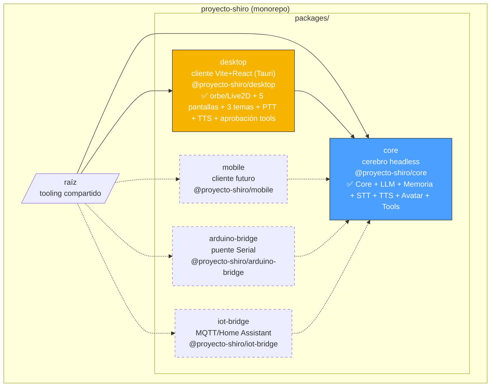
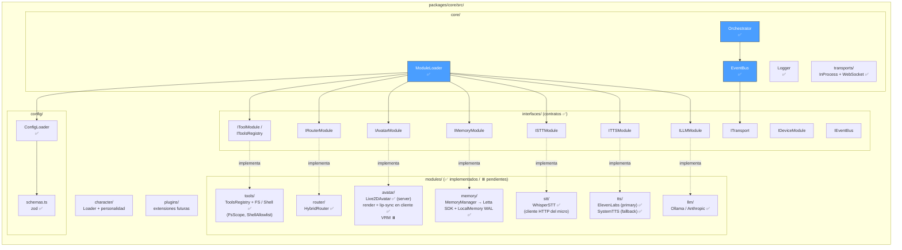
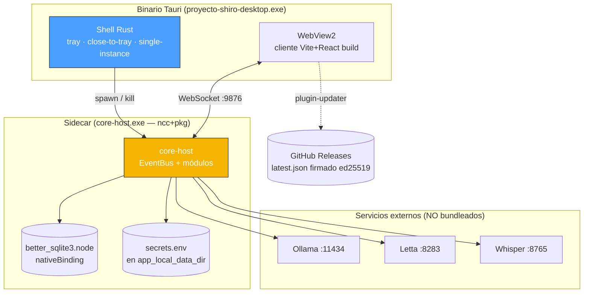
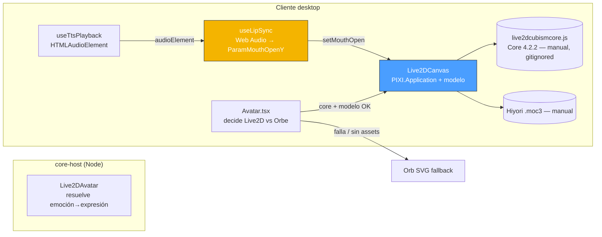
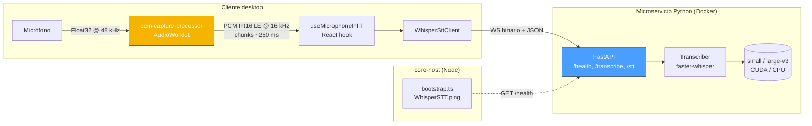
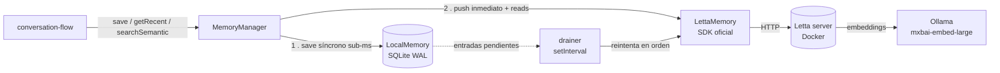
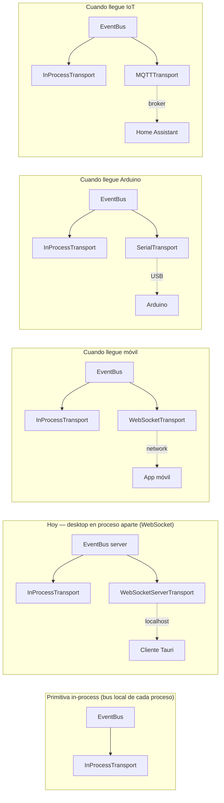

# Arquitectura de Proyecto Shiro

Documento vivo. Se actualiza cuando cambia algo estructural. Para el
detalle de **por qué** se decidió algo, ver [`adr/`](adr/).

> **Última actualización**: 2026-07-15 — hitos **Agentic tools** ✅ y
> **Self-improvement** ✅ completos (sobre Setup, Core, Cliente desktop, LLM,
> Memoria, STT, TTS, Avatar Live2D, Packaging Tauri). Shiro pasó de
> interlocutora a **agente** (lee/escribe archivos y ejecuta comandos
> allowlisted en un loop tool-use con modal de aprobación —
> [ADR 0022](adr/0022-shiro-agentic-tools-fs-shell.md)) y de agente a
> **contribuidora de su propio repo** (propone PRs desde un worktree aislado,
> propose-only — [ADR 0023](adr/0023-shiro-self-improvement-propose-only.md)).
> Antes, el hito **Packaging Tauri** empaquetó todo como binario Tauri 2.0
> (Windows) con sidecar `core-host`, tray, auto-updater firmado y setup wizard
> ([ADR 0024](adr/0024-packaging-tauri-windows-sidecar.md)). Ver las secciones
> [Tools agénticas](#tools-agénticas-loop-tool-use--aprobación) y
> [Self-improvement](#self-improvement-worktree-aislado--propose-only) abajo.
>
> **Seguridad**: revisión transversal en
> [`security-review-2026-07.md`](security-review-2026-07.md) +
> [ADR 0025](adr/0025-modelo-de-confianza-local-y-superficie-de-red.md) (modelo
> de confianza local, `Proposed`). Ver
> [Seguridad y modelo de confianza](#seguridad-y-modelo-de-confianza).

## Visión a vista de pájaro

Proyecto Shiro es un AI companion modular que se ejecuta como:

- **App desktop** — uso típico hoy. Cliente Vite+React empaquetado con
  **Tauri 2.0** como binario Windows, con el `core-host` viajando de sidecar
  (ver [Packaging Tauri](#packaging-tauri-binario-sidecar-y-updater) y ADR 0024).
- **Servicio headless** con clientes remotos (móvil, Arduino, IoT) — meta
  a medio plazo. El cerebro (core) corre como proceso/servicio
  independiente; cualquier cliente se conecta vía Transport.

Esta dualidad determina la arquitectura: un **cerebro (core)
independiente** y **clientes ligeros** que se conectan.

## Estructura del monorepo



Las líneas punteadas son paquetes futuros. Los flujos van **del cliente
al core** (los clientes consumen el cerebro vía interfaces y eventos).

## Composición del core



**Claves de lectura:**

- Las **interfaces** son contratos. Los módulos los implementan; el
  orchestrator y el resto solo conocen los contratos.
- El **EventBus** no llama directamente a los módulos: emite eventos
  y los receptores se suscriben. Esto rompe el acoplamiento. Ver
  [ADR 0001](adr/0001-arquitectura-modular-event-driven.md).
- El **ModuleLoader** lee `config/modules.config.yaml`, valida con zod,
  instancia la clase indicada para cada slot y la registra. Ver
  [ADR 0006](adr/0006-config-validation-zod.md) y
  [ADR 0007](adr/0007-module-loader-registry.md).
- El **Orchestrator** ata todo en el arranque, emite `bus:ready` y
  ofrece un punto de entrada limpio para los clientes.

## Composición del cliente desktop

`@proyecto-shiro/desktop` (Vite + React 18 + TS strict) consume el core
como dependencia local del workspace y se conecta al `core-host` por
WebSocket. Empaquetado con Tauri 2.0 (ADR 0024). Estructura actual (ADRs
0008-0010, 0021-0024):

```
packages/desktop/src/
├── main.tsx                     ← Entry: monta React + el BusProvider
├── App.tsx                      ← Switch de pantallas + CompanionProvider
├── bus-context.tsx              ← BusProvider (InProcess + WebSocket al core-host)
├── companion-context.tsx        ← CompanionProvider: reducer del estado del chat
├── screens/
│   ├── Conversation/            ← ConversationScreen + ChatPanel
│   ├── Modules/                 ← UI sobre modules.config.yaml
│   ├── Character/
│   ├── Avatar/
│   └── Setup/                   ← wizard de salud + API keys en runtime
├── components/
│   ├── Orb/                     ← Placeholder visual del avatar (fallback)
│   ├── Avatar/                  ← Decide Orb vs Live2D + lip-sync + expresión
│   ├── ToolApproval/            ← Modal de aprobación de tools `confirm`
│   ├── SelfDev/                 ← Panel de estado del flujo self-dev
│   ├── ThemeSwitcher/
│   ├── Icons/
│   └── ErrorBoundary.tsx
├── audio/                       ← captura PTT (AudioWorklet) + useTtsPlayback
├── updater/                     ← useAppUpdater + UpdateBanner (auto-updater)
├── health/                      ← wizard de salud + useSecretsSave
└── themes/                      ← kawaii / cyber / editorial (CSS vars)
```

**Tres temas swap-eables** (kawaii pastel / cyberpunk / editorial)
definidos por CSS vars; el usuario los cambia desde settings sin
recompilar. Ver el bundle de diseño en
[`docs/design-mockup/`](design-mockup/).

### Mapeo state ↔ EventBus

El reducer del cliente se alimenta de eventos del core, y dispara
acciones cuando el usuario actúa:

| Acción del reducer    | Origen                                                                    | Evento del EventBus |
| --------------------- | ------------------------------------------------------------------------- | ------------------- |
| `LISTEN_START`        | `bus.on('stt:listening')` — emitido por el hook PTT al arrancar           | `stt:listening`     |
| `STT_PARTIAL`         | `bus.on('stt:partial')` — partial del microservicio whisper               | `stt:partial`       |
| `STT_FINAL`           | `bus.on('stt:transcribed')` — final del microservicio whisper             | `stt:transcribed`   |
| `USER_SAID`           | `bus.on('user:message')` — texto tipeado **o** transcrito                 | `user:message`      |
| `THINK_START`         | `bus.on('router:routed')`                                                 | `router:routed`     |
| `SHIRO_REPLY`         | `bus.on('llm:responded')`                                                 | `llm:responded`     |
| (sin acción)          | `bus.on('tts:audio')` → `useTtsPlayback` hace fetch + reproduce el blob   | `tts:audio`         |
| (cliente origina)     | `bus.emit('tts:cancel')` cuando el usuario interrumpe a Shiro mid-speech  | `tts:cancel`        |
| `SPEAK_END`           | `bus.on('tts:audio-ended')` — emitido por el cliente al `ended` del audio | `tts:audio-ended`   |
| `HYDRATE_FROM_MEMORY` | `bus.on('memory:snapshot')` — server empuja al reconectar                 | `memory:snapshot`   |

> **Wiring voz → texto unificado**: `useCompanionState` re-emite
> `user:message` al recibir `stt:transcribed` con texto no vacío. Así
> el historial y el pipeline conversacional ven un solo camino,
> independiente de si el origen fue tipeado o hablado. El texto vacío
> (silencio puro, ruido) NO emite — evita disparar un turno en blanco.

Convenios documentados en
[ADR 0010](adr/0010-wiring-cliente-core-eventbus.md) y
[ADR 0019 §5](adr/0019-stt-faster-whisper-microservicio-python.md).

## Flujo de una conversación típica

```mermaid
sequenceDiagram
    participant User as Usuario
    participant Client as Cliente desktop<br>(React + EventBus)
    participant Mic as Micro / AudioWorklet
    participant Whisper as services/whisper<br>(Python + faster-whisper)
    participant Bus as EventBus<br>(server-side)
    participant Router as HybridRouter
    participant LLM as Ollama / Claude
    participant Mem as Memory
    participant TTS
    participant Avatar as Orbe / Live2D
    participant Speaker as Audio out

    alt Usuario escribe
        User->>Client: tipea + Enter
        Client->>Bus: emit("user:message", { text })
    else Usuario habla (push-to-talk)
        User->>Mic: keydown(Space) → captura audio
        Client->>Bus: emit("stt:listening")
        loop ~250 ms acumulados por chunk
            Mic->>Whisper: chunk PCM Int16 LE @ 16 kHz (WS binario)
        end
        loop cada partial_interval_ms
            Whisper-->>Client: { type:"partial", text }
            Client->>Bus: emit("stt:partial", { text })
        end
        User->>Mic: keyup(Space) → stop
        Client->>Whisper: { type:"stop" }
        Whisper-->>Client: { type:"transcribed", text, isFinal:true }
        Client->>Bus: emit("stt:transcribed", { text, isFinal:true })
        Client->>Bus: emit("user:message", { text })
    end

    Bus->>Router: deliver
    Bus->>Mem: deliver (registra mensaje user)

    Router->>LLM: route() → local | cloud
    LLM->>Mem: pide contexto reciente
    Mem-->>LLM: contexto
    LLM->>Bus: emit("llm:responded", { text, emotion })

    Bus->>Client: deliver (orbe cambia color, subtítulos)
    Bus->>Avatar: deliver (mismo evento → expresión)
    Bus->>Mem: deliver (registra respuesta assistant)

    LLM->>TTS: tts.synthesize(text, emotion)
    TTS-->>LLM: { audio: Buffer, mimeType }
    Note over TTS: TtsWithFallback intenta ElevenLabs<br/>y cae a SystemTTS si falla
    LLM->>Bus: emit("tts:audio", { url, audioId, mimeType })
    Bus->>Client: deliver
    Client->>TTS: GET /audio/&lt;id&gt;.&lt;ext&gt;
    TTS-->>Client: bytes
    Client->>Speaker: HTMLAudioElement.play()
    Avatar->>Speaker: lip sync sincronizado
    Speaker->>User: voz + animación
    Client->>Bus: emit("tts:audio-ended", { audioId })
```

**Notas del flujo:**

- El **cliente es el origen** del evento `user:message` (tanto si el
  input es texto como si es voz transcrita).
- Un mismo evento (`llm:responded`) tiene **varios suscriptores**: el
  cliente actualiza UI, el TTS lo convierte en audio, el Avatar/Orbe
  lo usa para expresión emocional, la Memoria lo persiste. Ninguno
  sabe de los otros — solo ven el bus.
- El `HybridRouter` decide si responde el LLM local (rápido, gratis) o
  el cloud (mejor calidad) según la complejidad estimada del mensaje.
- La memoria se inserta en dos puntos: lee contexto para el LLM, escribe
  cada turno de la conversación.

## TTS: ElevenLabs + SystemTTS, audio HTTP efímero

La salida de voz (ver [ADR 0020](adr/0020-tts-elevenlabs-systemtts-fallback-y-multidevice-diferido.md)) se reparte así:

```mermaid
graph LR
    subgraph "core-host (Node)"
        Pipe[conversation-flow]
        Chain[TtsWithFallback]
        EL[ElevenLabsTTS<br/>primary]
        Sys[SystemTTS<br/>fallback]
        Cache[(AudioCache<br/>TTL 60s)]
        Route[GET /audio/&lt;id&gt;.&lt;ext&gt;<br/>HTTP route]
    end

    subgraph "Cliente desktop"
        Hook[useTtsPlayback]
        Audio[HTMLAudioElement]
    end

    Pipe -->|llm:responded → tts.synthesize| Chain
    Chain -->|primero| EL
    Chain -->|si falla| Sys
    EL -.HTTPS.-> EL11[(ElevenLabs API)]
    Sys -.child_process.-> SO[say.js → SAPI / NSSpeech / festival]
    Chain -->|Buffer + mimeType| Cache
    Cache -->|audioId + relativeUrl| Pipe
    Pipe -->|tts:audio { url, audioId, mimeType }| Hook
    Hook -->|GET| Route
    Route -->|bytes| Audio
    Audio -->|ended| Hook
    Hook -->|tts:audio-ended| Pipe

    style Chain fill:#4a9eff,stroke:#333,color:#fff
    style Cache fill:#f4b400,stroke:#333,color:#fff
    style Hook fill:#4a9eff,stroke:#333,color:#fff
```

- **Cadena `TtsWithFallback`**: el pipeline ve un solo `ITTSModule`. Por dentro, intenta `ElevenLabsTTS` (primary); si lanza (sin internet, cuota, 401, 5xx), prueba `SystemTTS` (voz del SO). Solo cuando los dos fallan, el server emite `tts:audio-ended` directo para desbloquear al cliente.
- **In-process en core-host**, no microservicio aparte. ElevenLabs es API REST trivial — encapsularlo en Docker es overkill. La asimetría con Whisper (que sí es microservicio) refleja la realidad: **cloud APIs in-process, motores locales pesados en microservicio**. Cuando llegue UTAU/voz sintética post-5080, ese SÍ será microservicio.
- **Audio HTTP efímero**: el server cachea el buffer con un `audioId` único (TTL 60s) y expone `GET /audio/<audioId>.<ext>`. El bus solo lleva la URL (`tts:audio { url, audioId, mimeType }`) — bytes binarios no caben naturalmente en el wire-schema JSON, y servir por HTTP permite que solo los clientes que reproducen hagan el fetch.
- **Reproducción en el cliente**: `useTtsPlayback(bus)` crea un `HTMLAudioElement`, hace `fetch(url)`, reproduce, y emite `tts:audio-ended` al `ended` (o al `error`). El **`speaking: true`** del reducer se mantiene hasta entonces.
- **Cancelable mid-speech**: el cliente emite `tts:cancel { audioId }` cuando el usuario interrumpe (PTT o tipeo durante speaking). El server invalida el `audioId` en el cache (cualquier fetch posterior recibe 410). El cliente que estaba reproduciendo hace `audio.pause(); audio.src = ''`.
- **Mute por cliente**: `useTtsPlayback` persiste la preferencia en `localStorage` (`shiro:tts:muted`). Cuando `muted=true`, el cliente sigue emitiendo `tts:audio-ended` (para desbloquear el reducer) pero no reproduce. Preparación para multi-device — la lógica de "elegir dispositivo activo" queda para ADR futuro cuando aparezca el segundo cliente.

### Mapeo emoción → `stability`

`ElevenLabsTTS` lee `character.emotions[emotion].tts_stability` del YAML del personaje y lo usa como `voice_settings.stability` por turno. El resto de `voice_settings` (`similarity_boost`, `style`, `use_speaker_boost`) son constantes desde `config/modules.config.yaml`. Si la emoción no está mapeada o no hay character, cae a `default_stability` (0.75).

`SystemTTS` **ignora** la emoción con un debug log — `say.js` no expone parámetros emocionales y forzarlos vía pitch manual no compensa la complejidad.

### Quirks importantes

- **`ELEVENLABS_API_KEY` server-side**: vive solo en `process.env` del `core-host`. Sin ella, ElevenLabsTTS arranca con un `WARN` (no aborta) y todos los turnos caen al fallback.
- **El bootstrap solo crea el AudioCache si `simulationSpeed !== 0`** — `simulationSpeed === 0` es la señal de "modo test" y mantiene el simulador legacy de `tts:audio-ended` para tests que no levantan red real.
- **Sin auth en `GET /audio/`**: V1 local-only. CORS abierto (`Access-Control-Allow-Origin: *`). Cuando llegue multi-device público, habrá que firmar/limitar las URLs.
- **WAV de SystemTTS son ~50-200 KB** para frases cortas — manejable en memoria sin streaming. Si el contenido crece, habrá que stream-pipe el archivo.

## Packaging Tauri: binario, sidecar y updater

El último hito del MVP (ver [ADR 0024](adr/0024-packaging-tauri-windows-sidecar.md)) envuelve todo en un binario nativo que el usuario instala y abre con doble click. La pieza clave es que **el `core-host` no desaparece** al empaquetar: viaja como **sidecar** que el shell de Tauri lanza y mata.



- **Solo Windows x64 en V1** (ADR 0024 §1): el equipo no tiene Mac (firma/notarización de Apple) y Linux queda sin testing. El código es OS-agnóstico; el _build oficial_ es Windows. Targets `.msi` + `.nsis`.
- **Sidecar `core-host`** (§2): `@vercel/ncc` bundlea el JS a uno solo, `@yao-pkg/pkg` lo vuelve `.exe`, y el `better_sqlite3.node` se copia al lado (módulo nativo, cargado por `nativeBinding`). Tauri lo declara en `externalBin` y lo spawnea desde Rust en `setup` (no desde el webview, así no hace falta conceder `shell:allow-execute` en la ACL). Al salir de verdad (`RunEvent::Exit`) lo mata para no dejar el `:9876` huérfano.
  - **cwd = `app_local_data_dir`**: el config usa `db_path: ./data/memory.db` _relativo_; fijando el cwd a `%LOCALAPPDATA%\com.pipelol.proyecto-shiro`, el WAL (y con él el `agent_id` de Letta) cae siempre en el mismo sitio escribible. Sin esto, cada arranque resolvía un `memory.db` distinto y provisionaba un agente nuevo → la memoria no continuaba.
  - **Best-effort**: si faltan los recursos del sidecar (modo dev sin `build:sidecar`), Rust loguea y sigue — el dev corre el `core-host` a mano. Y si el `:9876` ya está ocupado, el sidecar que llega tarde se aparta con código 0 en vez de crashear.
- **Setup wizard + healthcheck** (§6): el `core-host` chequea **server-side** Ollama/Letta/Whisper (evita CORS del webview) y la _presencia_ (nunca el valor) de las API keys, y emite `system:health`; el cliente lo renderiza. Las **keys se introducen desde la app** → el wizard emite `secrets:save` → el `core-host` escribe `secrets.env` (`mode 0600`) en su cwd; al arrancar, `loadSecretsEnv` las mete en `process.env` **sin pisar** un `.env` o env vars reales. Aplican en el siguiente arranque (los módulos LLM/TTS leen las keys al construirse).
- **Auto-updater** (§4): `tauri-plugin-updater` consulta un `latest.json` firmado con **ed25519** servido por **GitHub Releases**; el cliente (`useAppUpdater`) chequea al montar y, si hay versión nueva, ofrece descargar+reiniciar (`tauri-plugin-process`). Un check fallido (404 sin release aún, sin red) resuelve en silencio — el banner de error queda solo para fallos de instalación. La clave privada vive únicamente como secret de CI (`TAURI_SIGNING_PRIVATE_KEY`); el workflow `release.yml` (disparado por tag `v*.*.*`) construye, firma y publica el release con sus artefactos.
- **State del chat en el root**: el `CompanionProvider` monta el reducer del companion **una vez** por encima del switch de pantallas, así la conversación sobrevive a cambiar de pantalla y la suscripción a `memory:snapshot` está siempre viva para rehidratar al reconectar/recargar.
- **Diferido a post-MVP**: el **modo overlay** (ventana flotante always-on-top transparente estilo VTuber, §3) y los iconos de branding definitivos.

## Avatar Live2D: render en cliente + lip-sync

El avatar (ver [ADR 0021](adr/0021-avatar-live2d-pixi-display-fallback-orbe.md)) reparte responsabilidades igual que el resto: la **lógica vive server-side** (`Live2DAvatar` en el core resuelve emoción → expresión desde el character YAML) y el **render vive en el cliente** con PixiJS.



- **Librería**: `pixi-live2d-display-lipsyncpatch` (fork) sobre **PixiJS v7**. El Cubism Core debe ser **4.2.2** (SDK for Web 4) — el del SDK 5 (Core 6.0.1) crashea el renderer (`doDrawModel`). Core y modelo son propietarios, gitignored, descarga manual.
- **Fallback automático al orbe**: `<Avatar>` verifica que el modelo es alcanzable (HEAD) y que el Cubism Core cargó; si algo falla, importa nada de PixiJS y renderiza el `<Orb>`. El import de `Live2DCanvas` es **diferido** (dynamic import) para que el bundle de pixi-live2d-display —que lanza a top-level si el Core no está— no tumbe a quien no tenga los assets.
- **Lip-sync** (ADR 0021 §5): `useTtsPlayback` expone el `HTMLAudioElement` (con `crossOrigin="anonymous"`); `useLipSync` lo conecta a un `AnalyserNode` y mapea la amplitud RMS a `ParamMouthOpenY` cada frame vía un callback `setMouthOpen` que `Live2DCanvas` implementa sobre el modelo. Cero coste de red, sincronización exacta. En mute no hay análisis (boca cerrada).
- **Idle off por default**: las motions idle de Hiyori tocan `ParamMouthOpenY` y compiten con el lip-sync. `autoUpdate` es siempre `true` (para aplicar el parámetro al mesh) y la idle se desactiva apuntando `idleMotionGroup` a un grupo inexistente. El modelo igual respira y parpadea.
- **Expresiones por emoción** ✅: la cara interpola parámetros faciales Cubism (`ParamMouthForm`, cejas, mejillas, ojos sonrientes) hacia la emoción de `llm:responded` (`useAvatarExpression` + `expression-map.ts`). Hiyori no trae `.exp3.json`, así que se usan parámetros directos; el seam para `model.expression()` con un modelo que sí los traiga queda listo. La _precisión_ de la emoción la pone el LLM (Qwen 3b clasifica mal; Claude/un modelo mayor mejor) — el avatar refleja fielmente la que recibe.

## STT: microservicio Whisper + push-to-talk

La entrada de voz (ver [ADR 0019](adr/0019-stt-faster-whisper-microservicio-python.md)) se reparte en tres piezas:



- **Captura** vive en el cliente desktop, no en el core-host. `pcm-capture-processor.js` corre en el AudioWorklet thread, convierte Float32 a Int16 LE y decima al sample rate objetivo si el browser no respeta `sampleRate: 16000` al crear el `AudioContext`. El hook `useMicrophonePTT` enlaza `MediaStream` → AudioWorklet → WebSocket.
- **Microservicio Python** (`services/whisper/`) corre como contenedor Docker de larga vida, expone `GET /health`, `POST /transcribe` (batch) y `WS /stt` (streaming). Modelo `small` por defecto sobre CUDA con `int8`; se cambia a `large-v3` con `int8_float16` cuando hay Tensor Cores (RTX 2060+).
- **`WhisperSTT` en el core** es **solo** healthcheck + batch para tests/CLI. El bootstrap del core-host hace `ping()` no bloqueante al arrancar y avisa por `warn` si el micro no responde — el chat textual sigue funcionando sin él. El audio en vivo **nunca pasa por el core-host**.

### Protocolo del WebSocket `/stt`

Diseñado para que el **cliente desktop** lo consuma directamente (ver ADR 0019, decisión 3).

| Dirección      | Tipo de frame | Payload                                              | Cuándo                                       |
| -------------- | ------------- | ---------------------------------------------------- | -------------------------------------------- |
| Cliente→Server | binario       | PCM Int16 LE mono @ 16 kHz                           | Cada chunk de ~250 ms del worklet            |
| Cliente→Server | texto (JSON)  | `{"type":"stop"}`                                    | Al soltar Space / botón                      |
| Server→Cliente | texto (JSON)  | `{"type":"partial","text":"..."}`                    | Cada `partial_interval_ms` (default 2500 ms) |
| Server→Cliente | texto (JSON)  | `{"type":"transcribed","text":"...","isFinal":true}` | Después de `stop`. Cierra la conexión.       |
| Server→Cliente | texto (JSON)  | `{"type":"error","message":"..."}`                   | Cualquier fallo                              |

Una conexión = un turno. Tras `transcribed` el cliente cierra y abre otra para el siguiente PTT.

### Quirks importantes

- **`hotwords` no `initial_prompt`**: Whisper-small alucina el `initial_prompt` como output en chunks con perplejidad alta. `hotwords` (faster-whisper ≥1.1.0) sesga sin contaminar.
- **`device resuelto` no es trivial**: faster-whisper expone el device real en `WhisperModel._model.model.device`, no en el wrapper. El healthcheck lo lee de ahí.
- **GPU en Docker Desktop Windows**: requiere la sección `deploy.resources.reservations.devices: [{driver: nvidia, count: all, capabilities: [gpu]}]` en el compose **y** drivers GeForce recientes en el host. Sin esto el contenedor cae a CPU silenciosamente.
- **VRAM ajustada** (GTX 1650 4 GB): Whisper `small` + Ollama `qwen2.5:3b` + embeddings `mxbai-embed-large` cabe pero ajustado. La solución limpia es **sacar Whisper de la GPU** (`WHISPER_DEVICE=cpu` en `.env`) y dejar la VRAM para Ollama. Latencia STT × 2-4 pero todo funciona.

## Memoria: Letta canónico + WAL local

La memoria (ver [ADR 0017](adr/0017-memoria-persistente-local-y-letta.md) y
[ADR 0018](adr/0018-letta-sdk-oficial-embeddings-ollama.md)) la implementa el
`MemoryManager`, que cumple `IMemoryModule` y orquesta dos backends:



- **Escritura**: cada turno se persiste **primero** en el WAL local (SQLite,
  síncrono) y **luego** se empuja a Letta. Si Letta está caído, la entrada
  queda pendiente y el **drainer** la reenvía cuando vuelve. Cero turnos
  perdidos aunque Letta tartamudee.
- **Lectura** (`getRecent` cronológico + `searchSemantic` semántico): van a
  Letta, que es la verdad. Si Letta no está usable, devuelven `[]` rápido y
  el turno procede sin contexto (Shiro responde "ciego" ese turno).
- **Letta** se usa como _archival store_ semántico (no invocamos su flujo de
  agente; el LLM es nuestro). Los embeddings son **locales vía Ollama**.
- **Auto-provisión**: si no hay `agent_id` configurado, el manager crea el
  agente Letta al arrancar (con los handles de Ollama) y persiste su id en el
  WAL local para sobrevivir reinicios.

## Tools agénticas: loop tool-use + aprobación

El hito **Agentic** (ver [ADR 0022](adr/0022-shiro-agentic-tools-fs-shell.md))
convierte a Shiro en agente: además de hablar, **lee/modifica archivos y
ejecuta comandos**. Un slot nuevo `tools:` en el orchestrator
(`IToolsRegistry` de `IToolModule`) registra las herramientas; cada una
declara un `permissionTier`:

- `auto` (`fs:read`, `fs:list`) → se ejecuta sin preguntar.
- `confirm` (`fs:write`, `fs:delete`, `shell:exec`) → pide aprobación humana.

```mermaid
sequenceDiagram
    participant Claude as AnthropicLLM<br/>generateWithTools
    participant Loop as tool-loop<br/>(executor + gate)
    participant Gate as ApprovalGate
    participant Client as Cliente<br/>(modal)
    participant Tool as IToolModule
    participant Mem as MemoryManager

    Claude->>Loop: tool_use { name, args }
    alt tier auto
        Loop->>Tool: execute(args)
    else tier confirm
        Loop->>Gate: requestApproval()
        Gate->>Client: tool:requires-approval
        Client-->>Gate: tool:approval { approved }
        alt aprobada
            Loop->>Tool: execute(args)
        else cancelada
            Note over Loop: no se ejecuta
        end
    end
    Loop->>Mem: save(turno role:'tool')
    Loop-->>Claude: tool_result
    Claude->>Claude: ...sigue hasta el respond final
```

Piezas clave:

- **Loop tool-use** (solo slot cloud / Claude — ADR 0022 §5):
  `AnthropicLLM.generateWithTools` itera LLM↔tools hasta que el modelo emite
  el `respond` terminal (`{text, emotion}`). El local (Qwen 3b) **no** recibe
  tools (no hace tool-use fiable).
- **Seguridad**: `FsScope` confina los paths a una allowlist (containment +
  anti-symlink vía `realpath`); `ShellAllowlist` valida comando + args por
  regex. Ambos desde `modules.config.yaml`.
- **Aprobación** (ADR 0022 §4): el `ApprovalGate` (server) correla la petición
  por `requestId` y pausa el turno hasta el `tool:approval` del cliente (o un
  timeout). El modal del desktop (`ToolApprovalModal`) lo materializa —
  aprobación por acción, sin "remember".
- **Memoria** (ADR 0022 §6): cada acción (ejecutada o cancelada) se persiste
  como turno `role:'tool'` por el mismo WAL + drainer, con los detalles en
  `metadata` (`ToolTurnMetadata`). Así Shiro recuerda lo que hizo. Los turnos
  `tool` se filtran del chat del cliente (memoria interna, no burbujas).
- **Routing** (ADR 0022 §5): el `HybridRouter` gana la dimensión
  `requires_tools` (fast-path determinista + flag del clasificador) que fuerza
  cloud cuando el turno va a necesitar tools.

## Self-improvement: worktree aislado + propose-only

El hito **Self-improvement** (ver [ADR 0023](adr/0023-shiro-self-improvement-propose-only.md))
lleva lo agéntico un paso más: Shiro propone **PRs a su propio repo**. Es
_propose-only_ — el humano siempre mergea. Vive en `core-host/src/selfdev/`,
reusa el loop tool-use y el `ApprovalGate` del hito Agentic, y **solo se activa
en entorno de desarrollo** (repo clonado + `git`/`gh`/`npm`; en el binario
instalado queda apagado por auto-detección con `git rev-parse` + `gh`).

**Trigger**: la tool `selfdev:propose` (tier `confirm`, en el registry del
chat). Cuando el usuario pide "proponé un fix para X", el LLM cloud la llama; el
modal de aprobación arranca la sesión **en background** (no bloquea el turno).

El **`SelfDevSession`** orquesta la secuencia determinista (el LLM solo razona
código):

1. **setup** — `git fetch` + worktree aislado (`../shiro-selfdev`, rama
   `shiro/<topic>`) + `linkNodeModules` (enlaza el `node_modules` del repo sin
   `npm ci`: terceros → repo por junction, `@proyecto-shiro/*` → worktree, para
   que build/eval validen el código del worktree).
2. **generate** — sub-loop `generateWithTools` con un `IToolsRegistry` de fs
   **scoped al worktree** (todas `auto`) + **denylist de inmutables**
   hardcodeada (carácter, ADRs, `config/`, `safety/`, `.env*`): si el LLM
   intenta escribir uno, recibe `IMMUTABLE_PATH`. Usa `max_tokens` alto (el
   `content` de un `fs:write` de un archivo entero no entra en los 1024 del chat).
3. **verify** — reconstruye `core` (único `dist` cross-package) + corre el eval
   (`format:check`/`lint`/`typecheck`/`test`). Si falla, realimenta la salida y
   reintenta la generación (máx `max_fix_iterations`).
4. **PR** — si el eval está verde: commit + push a `shiro/<topic>` + segundo
   modal de aprobación (con el `git diff`) → `gh:pr-create` (allowlist
   **hardcodeado** a `gh pr create` — no puede mergear ni hacer releases).
5. **cleanup** — quita el worktree (solo en éxito; en fallo lo deja para
   inspección — el `remove` en Windows borra el dir con `fs.rm` junction-safe,
   porque `git worktree remove` deja el `node_modules` enlazado).

**Fronteras duras** (no "si el LLM se acuerda"): eval-antes-de-PR e
inmutabilidad son estructurales; `git push` está acotado por regex a ramas
`shiro/…` (nunca develop/main); el `HybridRouter` fuerza cloud para los gatillos
de self-dev (`self-dev`, `PR`, `pull request`).

**Cliente**: eventos `selfdev:progress`/`selfdev:done` → panel `SelfDevStatus`
(fase en curso + link del PR o motivo del fallo). Los dos modales de aprobación
reusan el `ToolApprovalModal` del hito Agentic. Al terminar, Shiro lo anuncia
por voz (`llm:responded` + TTS).

**Diferido** (Fase 2): persistencia de la sesión en Letta (qué propuso y por
qué), una tool de edición por parche (hoy reescribe el archivo entero) y
orquestación multi-agente (planear/ejecutar/revisar con modelos distintos).

## Seguridad y modelo de confianza

El modelo de amenaza vigente es **local, un solo usuario, sin exposición de red
intencional**. Bajo ese supuesto, varias fronteras se dejaron abiertas a
propósito y otras son salvaguardas reales. La revisión transversal de 2026-07
([`security-review-2026-07.md`](security-review-2026-07.md)) las cataloga; lo
esencial:

- **Salvaguardas reales** (a mantener): spawn **sin shell** en `shell:exec`
  (cero inyección), `ShellAllowlist` (comando + args por regex) y `FsScope`
  (containment + anti-symlink) para las tools agénticas; **denylist de
  inmutables hardcodeada** y `gh` acotado a `gh pr create` en self-dev;
  `ApprovalGate` con timeout para las tools `confirm`; cota de vueltas del
  tool-loop; CSP sin `unsafe-eval` y chat que renderiza texto plano.
- **Fronteras abiertas por el modelo local** (deuda si Shiro sale a red): el
  WebSocket `/bus` y el HTTP de audio del `core-host`, y el WS `/stt` de
  Whisper, escuchan sin autenticación (y hoy en `0.0.0.0`). El
  [ADR 0025](adr/0025-modelo-de-confianza-local-y-superficie-de-red.md)
  (`Proposed`) formaliza esta postura, propone cerrar la superficie a
  `localhost` + validar `Origin`, y fija el **trigger de reversión**: al
  añadir el primer cliente que no sea el desktop local, se introduce
  autenticación por token en el bus y el STT.

Cualquier cambio en las fronteras de confianza (auth, bind, permisos de tools,
ACL de Tauri) debe pasar por —o superseder— el ADR 0025.

## Evolución de transportes

Desde [ADR 0012](adr/0012-split-cliente-server-core-host.md), el cliente
desktop corre en **su propio proceso** y habla con el `core-host` por
**WebSocket**: el server monta un `WebSocketServerTransport` (que también
aloja la ruta HTTP del audio TTS) y el cliente un `WebSocketTransport`, cada
uno sobre su `InProcessTransport` local. Conforme lleguen clientes en otros
dispositivos, se añaden transports nuevos **sin tocar los módulos existentes**.



**Importante:** los módulos existentes (LLM, TTS, etc.) **no cambian**
cuando se añade un transporte nuevo. Solo se inyecta el transport
adicional al EventBus en el arranque. Ver
[ADR 0003](adr/0003-transport-abstraction-device-registry.md).

## Configuración

Dos archivos YAML en `config/`:

- **`modules.config.yaml`**: qué implementación se usa en cada slot
  (LLM, TTS, STT, Memory, Avatar, Router). Cadenas de fallback.
- **`devices.config.yaml`**: catálogo de dispositivos IoT/Arduino
  controlables (placeholder hoy, se llenará junto con los bridges).

El `ModuleLoader` (ya implementado) lee el primero al arrancar y
valida con **zod**. El `DeviceRegistry` (interfaz definida, sin impl
todavía) leerá el segundo.

Ver [ADR 0006](adr/0006-config-validation-zod.md).

## Personalidad y personaje

El "carácter" del companion (Shiro) vive en
`packages/core/src/character/characters/default.yaml`. Contiene:

- Identidad (nombre, pronombres, backstory).
- Rasgos de personalidad y estilo de habla.
- Mapeo de **emociones → parámetros TTS y expresiones del avatar**.

El `CharacterLoader` carga este YAML al arrancar el `core-host` y
`buildSystemPrompt` lo convierte en el system prompt que se inyecta en cada
conversación; los parámetros emocionales se propagan al TTS
(`emotion → stability`) y al Orbe/Avatar (`emotion → expresión`) en cada
respuesta.

El **orbe placeholder** consume el campo `emotion` del payload de
`llm:responded` y mapea cada emoción a un gradiente de color via
CSS vars del tema activo. Ver
[ADR 0009](adr/0009-orbe-placeholder-avatar.md).

## Cómo añadir un módulo nuevo (en 5 pasos)

1. Decide qué interfaz implementa (`ILLMModule`, `ITTSModule`, etc.).
   Si no encaja, considera si necesitas una nueva interfaz (escribe un ADR).
2. Crea la clase en `packages/core/src/modules/<categoría>/MiModulo.ts`.
3. Implementa los métodos de la interfaz. Comunica vía EventBus.
4. Registra el módulo en `config/modules.config.yaml` (campo `active`
   del slot correspondiente) y en `ModuleLoader` (registry).
5. Añade tests en `packages/core/tests/unit/` y opcionalmente
   integración en `packages/core/tests/integration/`.

Tiempo objetivo: menos de 2 horas para un módulo simple.

## Cómo añadir una pantalla nueva al cliente

1. Crea `packages/desktop/src/screens/MiScreen.tsx`.
2. Suscríbete a eventos del bus con `useBusEvent` y/o lee state del
   reducer con `useCompanionState`.
3. Si necesitas state UI local, usa `useState` en el propio componente.
4. Añade entrada en el sidebar (`packages/desktop/src/components/Sidebar`).
5. Tests con Vitest + React Testing Library en
   `packages/desktop/tests/`.

## Referencias internas

- [`adr/`](adr/) — historial completo de decisiones arquitectónicas.
- [`design-mockup/`](design-mockup/) — bundle del prototipo de Claude
  Design (referencia visual, no código de producción).
- [`../plan-modular-ai-companion.md`](../plan-modular-ai-companion.md) —
  visión y plan original (histórico — conserva la numeración antigua
  de fases).
