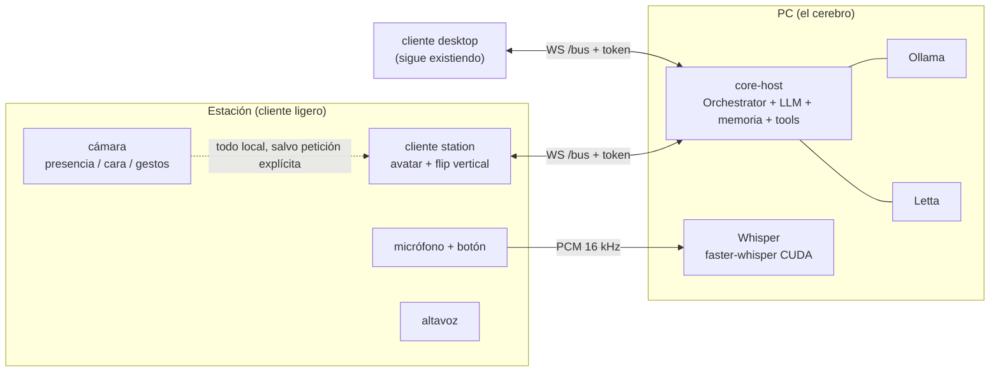

# Estación holográfica de Shiro

Documento vivo. La **decisión** y su porqué están en
[ADR 0026](adr/0026-estacion-holografica-pepper-ghost-cliente-ligero.md); aquí
vive el **cómo**: plan por fases, lista de materiales y guía óptica.

> **Estado**: Fase 1 sin empezar. Nada comprado, nada implementado.

## Qué es

Un objeto de escritorio —cilindro o cubo— donde Shiro aparece flotando, con
micrófono, cámara y altavoz, para hablar con ella sin usar la ventana de la PC.
El cerebro sigue en la PC: la estación es un **cliente ligero** que se conecta
al `core-host` por WebSocket, igual que el desktop.



La respuesta **sale por donde entró**: si le hablas a la estación, responde la
estación; si escribes en el desktop, responde el desktop. Se marca con el
`clientId` de origen del turno.

## Cómo funciona la óptica

Pepper's ghost de **lámina única**. No es un holograma: es un reflejo. Una
lámina semiespejo a 45° refleja hacia ti una pantalla que está arriba mirando
hacia abajo, y tu cerebro coloca esa imagen flotando en el vacío negro que hay
al otro lado del cristal.

```
     ┌──────────────────────┐
     │  ▓▓▓▓▓▓▓▓▓▓▓▓▓▓▓▓▓   │ ← pantalla, mirando ABAJO
     │   ╲                  │   (imagen volteada en vertical)
     │     ╲                │
  👁 ───────→╲  45°         │       imagen virtual: Shiro
   ▲ │         ╲            │       de pie, flotando
   │ │           ╲          │           ( ◉ )
   └─│── cámara ──╲─────────│ ← lámina semiespejo
     │ (head-track)         │
     │  ░░░ negro mate ░░░  │ ← fondo y trampas de luz
     └──────────────────────┘
        capucha (boca al frente)
```

Lo que hay que respetar, por orden de importancia:

1. **Fondo negro absoluto.** Es el 80% del efecto. Interior negro mate, y si es
   posible **forrado con papel flocado o terciopelo negro** — el PLA negro
   impreso sigue teniendo algo de brillo. La geometría (deflectores, cantos en
   cuchillo) la imprimes; el acabado mate lo pegas encima.
2. **Nada de luz parásita entrando por la boca.** Capucha profunda. La luz
   ambiente directa sobre la lámina mata la ilusión antes que ninguna otra cosa.
3. **Lámina fina.** Un acrílico grueso refleja en sus **dos** caras y produce
   una imagen fantasma doble, desplazada. Con 1-2 mm apenas se nota; con 5 mm es
   evidente. Un beam splitter de verdad la elimina, pero cuesta bastante más.
4. **Pantalla OLED si puede ser.** En OLED el negro no emite luz, así que el
   fondo del avatar desaparece de verdad. En LCD el negro sigue emitiendo algo y
   se ve un rectángulo grisáceo flotando alrededor de Shiro.
5. **Profundidad de la capucha ≥ distancia pantalla-lámina.** La imagen virtual
   aparece tan por detrás de la lámina como la pantalla está por delante; si la
   caja es corta, Shiro "sale" por la pared del fondo.
6. **Ángulo ajustable.** 45° es el nominal, pero depende de la altura de tus
   ojos y de dónde pongas la estación. Que la montura permita ±5° ahorra un
   rediseño entero.
7. **Flip vertical en el render.** El reflejo invierte la imagen. Es un
   `transform: scaleY(-1)` — el eje correcto se confirma en 2 minutos contra la
   maqueta, no sobre el papel.

## Plan por fases

Cada fase entrega algo usable y responde una pregunta. La Fase 1 es un **gate**:
si el efecto no convence ahí, el hito se replantea antes de gastar.

### Fase 1 — Maqueta óptica (gate) · ~30 € · 1-2 findes

**Pregunta que responde:** ¿me convence el efecto, en mi habitación, con mi luz?

Cero hardware nuevo y cero código de red. Caja de cartón pluma o acrílico
cortado a mano, un monitor o tablet que ya tengas colocado boca abajo encima, y
el **cliente desktop actual** mostrando el avatar con el flip.

- Lámina semiespejo cortada a medida.
- Interior forrado de negro mate.
- Flag `mirror` en el componente `Avatar` (`transform: scaleY(-1)`).

**Entregable:** una decisión informada, tomada mirando el cacharro encendido.
Prueba con la persiana subida y bajada, y de día y de noche.

### Fase 2 — Transporte autenticado · solo software

**Pregunta que responde:** ¿puede un cliente que no está en la PC hablar con el
`core-host` de forma segura?

Implementar el [ADR 0027](adr/0027-autenticacion-token-bus-stt-multicliente.md)
entero. Es **prerrequisito duro** de todo lo demás y se puede probar desde
cualquier portátil de la LAN, sin hardware de la estación.

- Token en el handshake, bind explícito, allowlist de `Origin`, tope de buffer
  en Whisper.
- `clientId` en el envelope del wire.
- Propiedad de sesión en `tool:approval`.
- Enrutado de la respuesta por `clientId` (cierra el diferido del ADR 0020).

### Fase 3 — Cliente estación, sin carcasa · ~200-300 €

**Pregunta que responde:** ¿aguanta el hardware, y se usa a gusto sin teclado?

`packages/station`: la app en modo kiosco, sin teclado ni ratón, con el flip y
el botón físico como push-to-talk. Todo sobre la mesa, con periféricos genéricos
y sin carcasa bonita.

> ⚠️ **Riesgo a despejar pronto**: que una Raspberry Pi 5 mueva PixiJS + Cubism
> a 30 fps **no está verificado**. Es el mayor riesgo técnico del hito. Pruébalo
> en cuanto tengas la Pi, antes de diseñar la carcasa alrededor de ella. Si no
> da, el plan B es un mini-PC x86 de segunda mano — cambia el alojamiento
> interno, no el resto del diseño.

### Fase 4 — Carcasa impresa · ~15-25 € de filamento

Ahora sí, el diseño de verdad, con las medidas reales de los componentes de la
Fase 3: capucha con trampas de luz, montura de lámina ajustable, alojamientos de
Pi/pantalla/cámara/micro, paso de cables, y **base con patrón de tornillos plano
y hueco de cable** para el módulo giratorio futuro.

Iterativo por naturaleza — cuenta con 2-3 impresiones de la capucha hasta acertar
con la luz parásita.

### Fase 5 — Wake word

Módulo de wake word **local, en el dispositivo**. El audio no sale de la
estación hasta que dispara. Añade el interruptor de corte físico del micro.
A partir de aquí el botón es el fallback, no el modo principal.

### Fase 6 — Visión

La fase más larga y la que más código nuevo trae. `IVisionModule` nuevo, en
este orden de dificultad creciente:

1. **Presencia** — hay alguien delante.
2. **Reconocimiento** — quién es (embeddings locales, **nunca imágenes**).
3. **Gestos y seguimiento de mirada** — el avatar te mira.
4. **Multimodal bajo petición** — frame a la nube solo cuando lo pides, con LED
   de cámara activa encendido.

### Post-estación

- **Avatar 3D (VRM) + head-tracking con proyección fuera de eje.** El paralaje
  de movimiento es el mayor salto de realismo disponible, y no cuesta hardware:
  la cámara ya está puesta. Sin tocar la carcasa.
- **Base giratoria** — primera implementación real de `IDeviceModule`.
- **Segunda lámina trasera** — vista de espalda a tamaño completo, si alguna vez
  se quiere 360°.

## Lista de materiales

Orientativa, precios de referencia. Nada de esto se compra antes de pasar la
Fase 1.

| Componente          | Fase | Coste aprox. | Notas                                                                     |
| ------------------- | ---- | ------------ | ------------------------------------------------------------------------- |
| Lámina semiespejo   | 1    | 15-35 €      | Acrílico 1-2 mm. Fino, para evitar la imagen fantasma doble.              |
| Cartón pluma, cola  | 1    | ~10 €        | Maqueta desechable.                                                       |
| Papel flocado negro | 1    | 5-15 €       | El acabado mate importa más de lo que parece.                             |
| Pantalla            | 1/3  | 0-120 €      | Fase 1: la que tengas. Fase 3: OLED pequeño si el presupuesto lo permite. |
| Raspberry Pi 5 8GB  | 3    | ~80 €        | O mini-PC x86 usado si la Pi no mueve el render.                          |
| Alimentación + SD   | 3    | ~25 €        |                                                                           |
| Micrófono USB       | 3    | 20-40 €      | En escritorio no hace falta array far-field.                              |
| Cámara              | 3    | 25-40 €      | Pi Camera Module 3 o webcam USB.                                          |
| Altavoz + amp       | 3    | 20-60 €      |                                                                           |
| Botón + interruptor | 3/5  | ~5 €         | PTT por GPIO y corte físico de micro.                                     |
| Filamento           | 4    | 15-25 €      | Impresión gratuita en la universidad.                                     |

**Fase 1: ~30 €. Fases 1-4 completas: ~250-400 €.**

## Riesgos abiertos

- **Render en la Pi 5** — sin verificar. Ver aviso en la Fase 3.
- **Eco acústico**: la estación se oye a sí misma por su propio altavoz. En
  escritorio, con micro cercano y volumen moderado, debería ser tolerable; si
  no, hace falta cancelación de eco. Se evalúa en Fase 3, no antes.
- **Latencia del audio por WiFi** hasta Whisper. El desktop hoy va por
  `localhost`; la estación cruza la red. Medir en Fase 3.
- **Calor** de pantalla y Pi dentro de una caja cerrada y sin ventilador (el
  ventilador está descartado por ruido junto al micro). Ventilación pasiva por
  convección en el diseño de la Fase 4.
- **La PC apagada deja la estación muerta.** Asumido en el ADR 0026. Si molesta
  en uso real, se reabre la opción híbrida con fallback a la nube.

## Referencias

- [ADR 0026](adr/0026-estacion-holografica-pepper-ghost-cliente-ligero.md) — la
  decisión y las alternativas descartadas.
- [ADR 0027](adr/0027-autenticacion-token-bus-stt-multicliente.md) — auth del
  bus y del STT (prerrequisito de la Fase 3).
- [ADR 0021](adr/0021-avatar-live2d-pixi-display-fallback-orbe.md) — avatar
  Live2D, que la estación reutiliza tal cual.
- [`architecture.md`](architecture.md) — arquitectura general.
